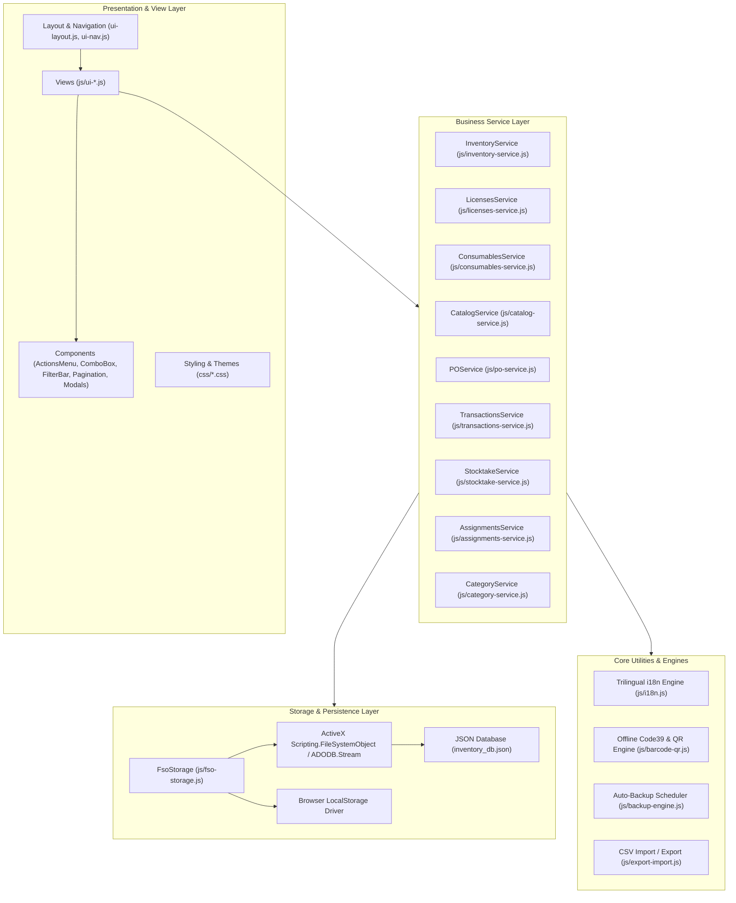
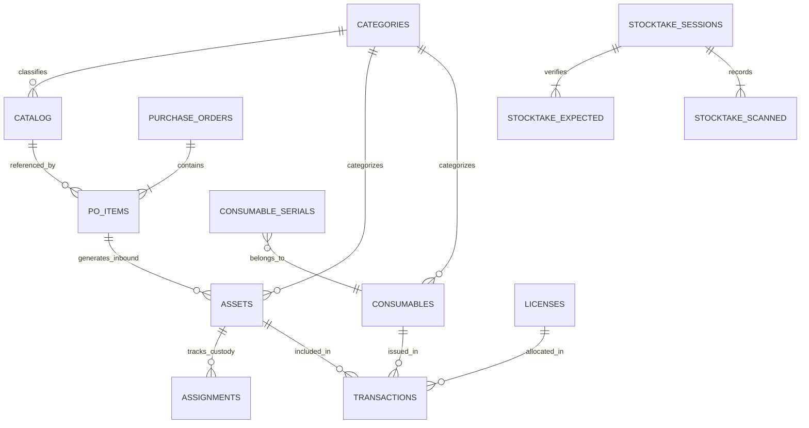

# ITIM-lite System Architecture & Database Specification

> Comprehensive system architecture, subsystem decomposition, and recorded database schema for ITIM-lite (AssetOps zero-backend Windows HTA & browser IT asset management system).  
> Extracted and compiled from project GraphRAG knowledge base (`.agent-context/`) and runtime configurations.

---

## 1. Architectural Overview

ITIM-lite is an offline-first, zero-backend IT Asset Management (ITAM) platform targeting corporate intranet environments. It runs natively on Windows client machines via Microsoft HTML Application (`mshta.exe`) with fallback compatibility for modern web browsers.

### Core Architectural Attributes
- **Pattern**: `Layered_Architecture` (Memorized in `.agent-context/architecture.json`)
- **Runtime Environment**: Windows MSHTA (`Trident / IE=edge` emulation mode) & Modern Chromium/WebKit browsers
- **Language Level**: Strict ES5 JavaScript (No transpiler required at runtime; no ES6 arrow functions, classes, `const`/`let`, or template literals in production assets)
- **Zero-Backend Persistence**: Native Windows Script Host `ActiveXObject("Scripting.FileSystemObject")` and `ADODB.Stream` (UTF-8) targeting local disk (`C:\...`) and SMB UNC network paths (`\\server\share\...`) with automatic `localStorage` fallback
- **Token-Bounded Modularity**: Strict architectural constraint mandating all source JavaScript modules remain strictly `< 300 LOC`

---

## 2. Layered Subsystems & Component Graph

The codebase is organized into four distinct architectural layers as indexed by GraphRAG:



### Layer Responsibilities
1. **Presentation & Views (`js/ui-*.js`, `css/*.css`)**:
   - `UI_Layout`: HTML view skeleton, topbar, sidebar, unified inventory toolbar, and dock containers.
   - `UI_Assets`: Unified inventory view aggregating hardware, software, and stock into a single table with segmented pill filters (`All`, `Hardware`, `Software`, `Stock`).
   - `UI_ItemDetail`: Two-column dashboard inspection modal with live SVG Code39 barcodes, dual QR tags (`ID` vs `SN`), serialized units table, and transaction history.
   - `UI_ItemPicker`: Typeahead keyboard-navigable multi-item picker supporting serial number verification on staging lists.
   - `UI_Inbound`: Purchase order creation, receiving workflow, and intake asset generation.
   - `UI_Audit`: Physical inventory counting, barcode scanning, surplus tracking, and reconciliation.
2. **Business Services (`js/*-service.js`)**:
   - Encapsulate domain logic, ID generators, validation rules, stock adjustments, seat calculations, and transaction recording.
3. **Core Engines**:
   - `I18N`: Dictionary-based runtime translation (English, Vietnamese, Japanese) and locale-aware date/time formatting.
   - `BarcodeQR`: Offline SVG-based vector barcode (Code39) and matrix 2D QR-code generators.
   - `BackupEngine`: Periodic snapshot background worker with rolling retention pruning.
4. **Persistence Layer (`js/fso-storage.js`)**:
   - Safe UTF-8 file reading and writing via `ADODB.Stream` and `Scripting.FileSystemObject`.

---

## 3. Database Architecture & Schema Specification

The database is an atomic JSON document store (`inventory_db.json`) loaded into memory at startup (`AppState.db`) and flushed synchronously to storage on write operations.

### Entity Relationship Diagram (ERD)



---

### Collection Schemas

#### 3.1. `categories`
Defines dynamic asset/stock categories and custom specifications schema.
```json
{
  "id": "cat-laptop",
  "name": "Laptop",
  "type": "hardware",
  "description": "Portable workstations",
  "customFields": [
    {
      "id": "cpu",
      "label": "CPU Processor",
      "type": "text"
    },
    {
      "id": "ram_gb",
      "label": "RAM (GB)",
      "type": "number"
    },
    {
      "id": "os",
      "label": "Operating System",
      "type": "select",
      "options": ["Windows 11 Pro", "macOS Sonoma", "Ubuntu 24.04"]
    }
  ]
}
```

#### 3.2. `catalog`
Master SKU catalog defining standardized equipment models and baseline specs.
```json
{
  "id": "SKU-1001",
  "sku": "SKU-1001",
  "name": "Dell Latitude 5530",
  "type": "hardware",
  "category": "Laptop",
  "model": "Latitude 5530 i7-1265U 16GB 512GB",
  "vendor": "Dell Direct",
  "notes": "Standard engineering laptop",
  "customFields": {
    "cpu": "Intel Core i7-1265U",
    "ram_gb": 16,
    "os": "Windows 11 Pro"
  }
}
```

#### 3.3. `assets`
Individual hardware asset units with unique tracking IDs, serial numbers, and lifecycle status.
```json
{
  "id": "AST-1001",
  "name": "Dell Latitude 5530",
  "category": "Laptop",
  "serial": "8HG3F42",
  "model": "Latitude 5530 i7-1265U 16GB 512GB",
  "status": "inuse",
  "assignedTo": "Sarah Jenkins",
  "department": "Engineering",
  "location": "Floor 3 - Desk 312",
  "purchaseDate": "2024-03-15",
  "warrantyExpiry": "2027-03-15",
  "poNumber": "PO-8001",
  "source": "PO_INBOUND",
  "notes": "Assigned with charger.",
  "customFields": {
    "cpu": "Intel Core i7-1265U",
    "ram_gb": 16,
    "os": "Windows 11 Pro"
  }
}
```
- **Status Enum**: `available` | `inuse` | `repair` | `retired`

#### 3.4. `licenses`
Software licenses, SaaS subscriptions, keys, and seat allocations.
```json
{
  "id": "LIC-2001",
  "software": "Microsoft 365 Business Premium",
  "vendor": "Microsoft CSP",
  "type": "Annual Subscription",
  "totalSeats": 50,
  "assignedSeats": 42,
  "key": "CSP-TENANT-AUTO",
  "expiryDate": "2026-12-31",
  "notes": "Cloud tenant renewal handled via CSP."
}
```

#### 3.5. `consumables`
Stock items, accessories, peripherals, and serialized consumable equipment pools.
```json
{
  "id": "CON-3004",
  "name": "Zebra DS2208 Handheld Barcode Gun",
  "category": "Peripherals & Tools",
  "quantity": 3,
  "minQuantity": 1,
  "location": "IT Tool Cabinet A",
  "isSerialized": true,
  "serials": [
    { "sn": "BG-2208-001", "status": "available", "location": "Shelf A1" },
    { "sn": "BG-2208-002", "status": "available", "location": "Shelf A2" },
    { "sn": "BG-2208-003", "status": "assigned", "assignedTo": "Logistics Dept", "location": "Dock Station" }
  ]
}
```

#### 3.6. `assignments`
Direct custody tracking records for hardware asset checkouts.
```json
{
  "id": "ASG-4001",
  "assetId": "AST-1001",
  "assetName": "Dell Latitude 5530",
  "employeeName": "Sarah Jenkins",
  "employeeEmail": "sarah.j@company.local",
  "department": "Engineering",
  "checkoutDate": "2024-03-20",
  "expectedReturnDate": "",
  "returnDate": "",
  "status": "active",
  "conditionOut": "Brand New in Box",
  "conditionIn": "",
  "notes": "Issued upon employee onboarding."
}
```

#### 3.7. `transactions`
Multi-item audit trail capturing bulk checkouts, returns, repairs, and retirements.
```json
{
  "id": "TXN-5001",
  "type": "CHECKOUT",
  "status": "active",
  "timestamp": "2024-03-20 09:30:00",
  "employeeName": "Sarah Jenkins",
  "department": "Engineering",
  "expectedReturnDate": "",
  "officer": "IT Admin",
  "itemCount": 1,
  "notes": "Issued upon employee onboarding.",
  "items": [
    {
      "assetId": "AST-1001",
      "name": "Dell Latitude 5530",
      "category": "Laptop",
      "serial": "8HG3F42",
      "condition": "Brand New in Box"
    }
  ]
}
```
- **Transaction Types**: `CHECKOUT` | `CHECKIN` | `repair` | `retired` | `STATUS_CHANGE`

#### 3.8. `purchaseOrders`
Inbound procurement management and automated asset intake.
```json
{
  "id": "PO-8001",
  "poNumber": "PO-8001",
  "vendor": "Dell Direct",
  "orderDate": "2024-03-01",
  "receivedDate": "2024-03-15",
  "status": "received",
  "notes": "Engineering laptops and 4K displays",
  "items": [
    {
      "masterId": "SKU-1001",
      "name": "Dell Latitude 5530",
      "category": "Laptop",
      "model": "Latitude 5530 i7-1265U",
      "qtyOrdered": 2,
      "qtyReceived": 2,
      "assetIds": ["AST-1001", "AST-1002"]
    }
  ]
}
```
- **PO Status**: `pending` | `partial` | `received`

#### 3.9. `stocktakeSessions`
Physical inventory audit sessions, scans, and variance reconciliation.
```json
{
  "id": "STK-7001",
  "name": "Q1 Initial Fleet Stocktake",
  "scope": { "type": "all", "value": "All Assets" },
  "status": "completed",
  "createdAt": "2024-03-01 08:00:00",
  "closedAt": "2024-03-01 11:30:00",
  "auditor": "IT Admin",
  "notes": "Baseline physical audit before Q2 onboarding.",
  "expectedAssets": [
    { "assetId": "AST-1001", "name": "Dell Latitude 5530", "category": "Laptop", "serial": "8HG3F42", "status": "inuse", "location": "Floor 3 - Desk 312" }
  ],
  "scannedAssets": [
    { "assetId": "AST-1001", "serial": "8HG3F42", "name": "Dell Latitude 5530", "category": "Laptop", "timestamp": "2024-03-01 09:15:00", "actualLocation": "Floor 3 - Desk 312", "actualCondition": "Good / Functional", "isSurplus": false }
  ]
}
```

#### 3.10. `auditLogs`
Immutable administrative event log.
```json
{
  "timestamp": "2024-03-20 09:30:00",
  "action": "CHECKOUT",
  "detail": "Asset AST-1001 checked out to Sarah Jenkins (Engineering)"
}
```

#### 3.11. `settings`
System storage configurations, backup cadence, and UI preferences.
```json
{
  "storagePath": ".\\data",
  "storageType": "local",
  "backupsPerDay": 4,
  "autoBackupIntervalMin": 360,
  "maxBackupCount": 20,
  "backupRetentionCount": 20,
  "autoCleanMode": "both",
  "autoCleanDays": 7,
  "orgName": "Corporate IT Services",
  "lastBackupTime": ""
}
```

---

## 4. Key Architectural Mandates & Protocols

1. **300 LOC Constraint**:
   Every source file (`js/*.js`) must remain under 300 lines of code. View logic and complex dialogs must be decomposed into reusable helper functions or sub-components.
2. **Pure ES5 & Windows MSHTA Compatibility**:
   - No ES6 syntax (no arrow functions, let/const, template literals, async/await).
   - Use `<button type="button">` instead of anchor tags (`<a href="javascript:void(0)">`) to prevent MSHTA from spawning external web browsers.
   - Avoid modern DOM APIs missing in IE11 (e.g. `Element.closest()`, `Element.remove()`).
3. **Mandatory i18n Localization**:
   - All user-facing strings across all dialogs, detail views, forms, and buttons must use `I18N.t(key)` across English (`en`), Vietnamese (`vi`), and Japanese (`jp`).
   - All timestamps and dates must format via `I18N.formatDate()` and `I18N.formatDateTime()`.
4. **In-Page Hidden Print Engine**:
   - Avoid popup windows (`window.open`) which trigger browser popup blockers. All equipment receipts and asset tag printing route through a temporary hidden `<iframe>` executing `printHtmlInPage()`.
